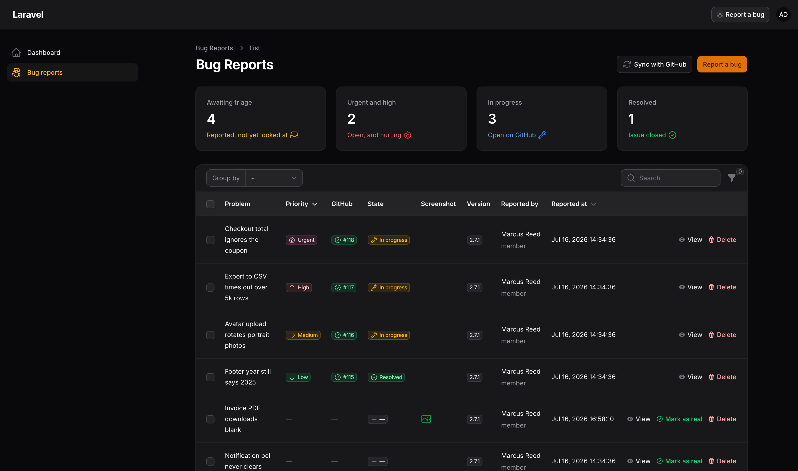
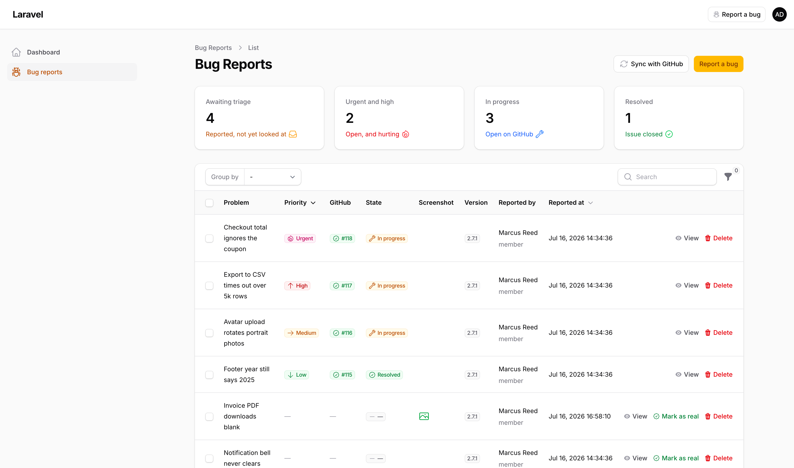

# Filament Bug Reports

[](https://packagist.org/packages/cerealkiller97/filament-bug-reports)
[](https://github.com/CerealKiller97/filament-bug-reports/releases)
[](https://github.com/CerealKiller97/filament-bug-reports/actions/workflows/tests.yml)
[](https://github.com/CerealKiller97/filament-bug-reports/actions/workflows/phpstan.yml)
[](https://github.com/CerealKiller97/filament-bug-reports/actions/workflows/type-coverage.yml)
[](LICENSE.md)

Collect bug reports from inside your Filament panel, and push the ones you confirm are real straight to GitHub as issues.

Your users get a **Report a bug** button in the panel's topbar and a short, plain-language form — no Markdown, no issue templates, no GitHub account. You get a triage table where a single click turns a report into a proper GitHub issue, and the issue's state (open/closed) is mirrored back onto the report automatically.

**📖 [Read the documentation](https://cerealkiller97.github.io/filament-bug-reports/)**

| Dark | Light |
| --- | --- |
|  |  |

## How it works

1. **Anyone in the panel reports a bug.** They describe the problem, list the steps that led to it, and optionally attach a screenshot. The report is stamped with the reporter, their role and the running app version — they aren't asked for any of it.
2. **A manager triages.** Reports land in a table only managers can see. Noise gets deleted; the real ones get **Mark as real**.
3. **A GitHub issue is created**, with the steps and screenshot formatted into the body. The issue number and URL are stored on the report.
4. **State syncs back.** An hourly command checks each linked issue: closed becomes *Resolved*, reopened flips back to *In progress*.

## Requirements

- PHP 8.3+
- Laravel 13.x
- Filament 5.x

## Installation

```bash
composer require cerealkiller97/filament-bug-reports
```

Publish and run the migration:

```bash
php artisan vendor:publish --tag=bug-reports-migrations
php artisan migrate
```

Then register the plugin on the panel you want it in:

```php
use CerealKiller97\FilamentBugReports\BugReportsPlugin;

public function panel(Panel $panel): Panel
{
    return $panel
        // ...
        ->plugin(
            BugReportsPlugin::make()
                ->authorizeManagementUsing(fn (User $user): bool => $user->isAdmin()),
        );
}
```

That single `authorizeManagementUsing` call matters: **management defaults to nobody**. Until you opt someone in, no one can see the report list — though everyone can still file a report.

Finally, point it at a repository with a token that has the `repo` (or `issues:write`) scope:

```dotenv
BUG_REPORTS_GITHUB_TOKEN=ghp_xxxxxxxxxxxx
BUG_REPORTS_GITHUB_REPOSITORY=acme/platform
```

See the [installation guide](https://cerealkiller97.github.io/filament-bug-reports/docs/installation) for the rest.

## Documentation

| | |
| --- | --- |
| [Authorization](https://cerealkiller97.github.io/filament-bug-reports/docs/authorization) | Who can file a report, and who can triage one. |
| [Reporting a bug](https://cerealkiller97.github.io/filament-bug-reports/docs/reporting) | The topbar button and the form behind it. |
| [The triage table](https://cerealkiller97.github.io/filament-bug-reports/docs/triage) | The stats, the grouping, and marking a report as real. |
| [The GitHub issue](https://cerealkiller97.github.io/filament-bug-reports/docs/github-issues) | What the created issue looks like, and which options GitHub honours. |
| [Keeping reports in sync](https://cerealkiller97.github.io/filament-bug-reports/docs/sync) | Mirroring issue state back onto the report. |
| [Configuration](https://cerealkiller97.github.io/filament-bug-reports/docs/configuration) | Every key in `config/bug-reports.php`. |
| [Translations](https://cerealkiller97.github.io/filament-bug-reports/docs/translations) | Changing the wording. |

## Testing

```bash
composer test            # Pest
composer lint            # Pint
composer analyse         # PHPStan
composer type-coverage   # Pest type coverage (must stay at 100%)
```

## Contributing

Pull requests are welcome — bug fixes, new features, better docs, or just a typo you spotted. See the [contributing guide](https://cerealkiller97.github.io/filament-bug-reports/docs/contributing) for the workflow, and open the PR even if you're unsure about it.

## License

Apache License 2.0. See [LICENSE.md](LICENSE.md).

---

Proudly made by [Stefan Bogdanovic](https://stefanbogdanovic.dev).
