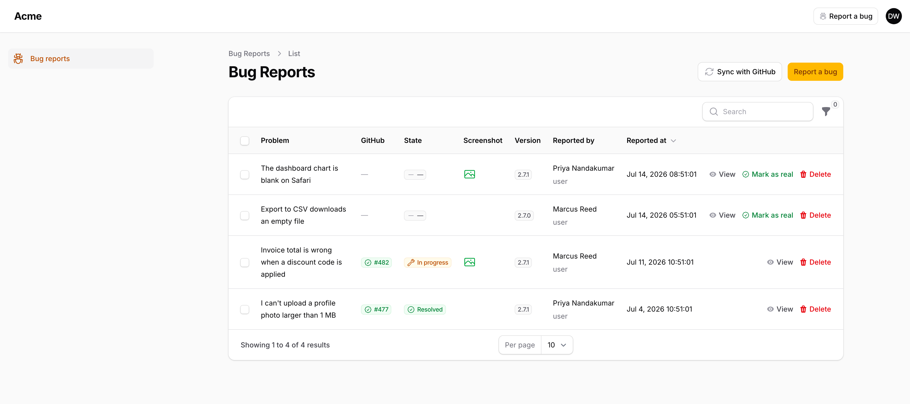
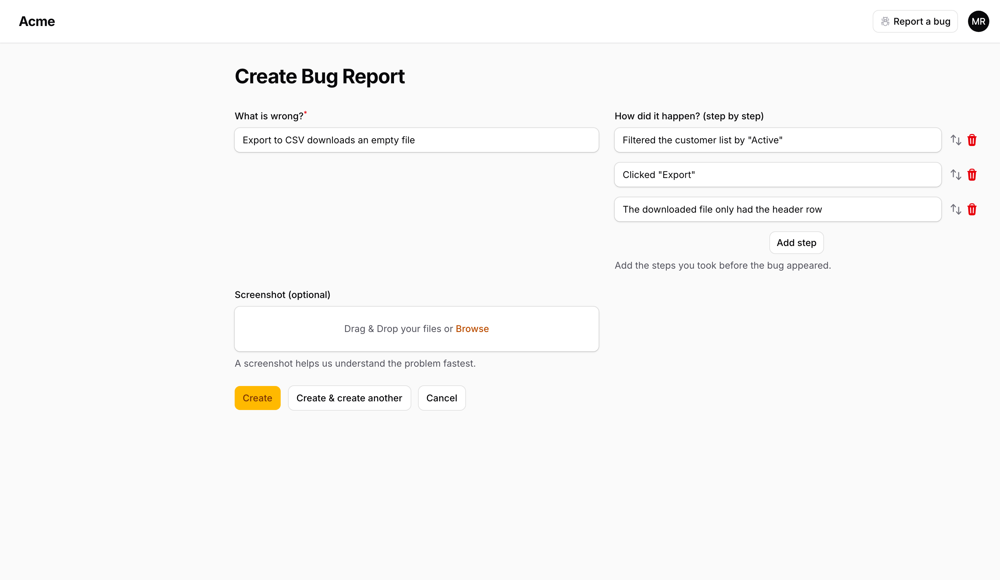
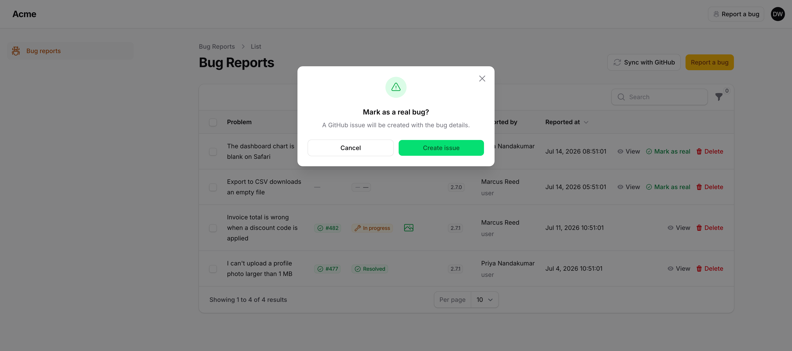

# Filament Bug Reports

[](https://packagist.org/packages/cerealkiller97/filament-bug-reports)
[](https://github.com/CerealKiller97/filament-bug-reports/releases)
[](https://github.com/CerealKiller97/filament-bug-reports/actions/workflows/tests.yml)
[](https://github.com/CerealKiller97/filament-bug-reports/actions/workflows/phpstan.yml)
[](https://github.com/CerealKiller97/filament-bug-reports/actions/workflows/type-coverage.yml)
[](LICENSE.md)

Collect bug reports from inside your Filament panel, and push the ones you confirm are real straight to GitHub as issues.

Your users get a **Report a bug** button in the panel's topbar and a short, plain-language form — no Markdown, no issue templates, no GitHub account. You get a triage table where a single click turns a report into a proper GitHub issue, and the issue's state (open/closed) is mirrored back onto the report automatically.



## How it works

1. **Anyone in the panel reports a bug.** They describe the problem, list the steps that led to it, and optionally attach a screenshot. The report is stamped with the reporter, their role and the running app version — they aren't asked for any of it.
2. **A manager triages.** Reports land in a table only managers can see. Noise gets deleted; the real ones get **Mark as real**.
3. **A GitHub issue is created**, with the steps and screenshot formatted into the body. The issue number and URL are stored on the report.
4. **State syncs back.** An hourly command checks each linked issue: closed becomes *Resolved*, reopened flips back to *In progress*.

## Requirements

- PHP 8.3+
- Laravel 13.x
- Filament 5.x

## Installation

```bash
composer require cerealkiller97/filament-bug-reports
```

Publish and run the migration:

```bash
php artisan vendor:publish --tag=bug-reports-migrations
php artisan migrate
```

Optionally publish the config file:

```bash
php artisan vendor:publish --tag=bug-reports-config
```

Then register the plugin on the panel you want it in:

```php
use CerealKiller97\FilamentBugReports\BugReportsPlugin;

public function panel(Panel $panel): Panel
{
    return $panel
        // ...
        ->plugin(
            BugReportsPlugin::make()
                ->authorizeManagementUsing(fn (User $user): bool => $user->isAdmin()),
        );
}
```

That single `authorizeManagementUsing` call matters: **management defaults to nobody**. Until you opt someone in, no one can see the report list — though everyone can still file a report.

## Who can do what

| | Report a bug | See the list, view, triage, delete |
|---|---|---|
| **Default** | any authenticated panel user | nobody |
| **Configured with** | `authorizeReportingUsing()` | `authorizeManagementUsing()` |

```php
BugReportsPlugin::make()
    // Who may triage reports and push them to GitHub. Default: nobody.
    ->authorizeManagementUsing(fn (User $user): bool => $user->hasRole('developer'))

    // Who may file a report. Default: every authenticated user.
    ->authorizeReportingUsing(fn (User $user): bool => $user->isStaff())

    // A label stored alongside the report, so you know who hit the bug.
    // Shows under the reporter's name in the table and in the GitHub issue.
    ->resolveReporterRoleUsing(fn (User $user): string => $user->role->label());
```

Non-managers never see the resource in the navigation, and the list page returns a 403 for them. They only ever reach the create form — via the topbar button — and are redirected back to the panel home after submitting.

## Reporting a bug

The **Report a bug** button is injected into the topbar next to global search, so it's reachable from every page in the panel.



Steps are a repeater — reporters add and reorder them one at a time, which tends to produce far better reproduction steps than a free-text box. The screenshot is optional and capped at 5 MB by default.

## Triaging and creating the issue

**Mark as real** asks for confirmation and a priority — low, medium, high or urgent — then creates the GitHub issue:



The priority is stored on the report, so the table can be sorted and filtered by it. Sorting ranks the values by urgency rather than alphabetically, and untriaged reports rank below every triaged one.

Picking one is optional: **low** is pre-selected, and a report marked as real without a priority being chosen is filed as low. The reasoning is that triage should never be blocked by a field, and a bug nobody felt strongly enough about to rank is, by definition, the least urgent one. Escalating later is a deliberate act; being nagged for an answer at the moment you just want the issue filed is not.

Priority is only ever set at triage time. An untriaged report has no priority at all — the column is null, and the table shows `—` — rather than a low that nobody actually decided on.

The action is idempotent and disappears once a report is linked, so a report can't produce two issues. If GitHub rejects the call, the error is surfaced in a notification and nothing is written locally.

The issue body is assembled from the report:

```markdown
## Details
**Reported by:** Marcus Reed (user)
**Priority:** High
**App version:** 2.7.1
**Reported at:** 11.07.2026. 10:45

## Steps to reproduce
1. Opened the "Billing" page
2. Added the coupon SPRING25 to an invoice of $400
3. The total showed $400 instead of $300

## Screenshot
https://acme.test/storage/bug-reports/invoice-total.png

---
_Automatically created from in-app bug report #12._
```

The screenshot is embedded as a URL, so GitHub can only render it if the disk you store it on is publicly reachable.

Everything [GitHub's create-an-issue endpoint](https://docs.github.com/en/rest/issues/issues#create-an-issue) accepts can be set under `github` in the config: `labels`, `assignees`, `milestone`, `type` and `issue_field_values`. Anything left empty is omitted from the request rather than sent as `null`, so GitHub applies its own default.

One caveat that comes from GitHub, not this package: a token **without push access** to the target repository has `labels`, `assignees`, `milestone` and `type` silently dropped. The issue is still created — just bare, with no error to catch. If your issues arrive unlabelled, check the token's scope first. `type` and `issue_field_values` additionally only work on organisation-owned repositories.

## Configuration

Point the package at a repository and give it a token with the `repo` (or `issues:write`) scope:

```dotenv
BUG_REPORTS_GITHUB_TOKEN=ghp_xxxxxxxxxxxx
BUG_REPORTS_GITHUB_REPOSITORY=acme/platform
```

Both fall back to `GITHUB_TOKEN` and `GITHUB_BUG_REPOSITORY` if you already have those set. Everything else lives in `config/bug-reports.php`:

```php
// The model a report belongs to. Point this at your own user model.
'user_model' => \Illuminate\Foundation\Auth\User::class,

// Stamped onto every report. When empty, falls back to the app's
// `app.version`, and then to 'dev'.
'app_version' => env('BUG_REPORTS_APP_VERSION', ''),

'screenshot' => [
    'disk' => env('BUG_REPORTS_SCREENSHOT_DISK', 'public'),
    'directory' => env('BUG_REPORTS_SCREENSHOT_DIRECTORY', 'bug-reports'),
    'max_size' => 5120, // KB
],

'github' => [
    'token' => env('BUG_REPORTS_GITHUB_TOKEN', env('GITHUB_TOKEN', '')),
    'repository' => env('BUG_REPORTS_GITHUB_REPOSITORY', env('GITHUB_BUG_REPOSITORY', '')),
    'labels' => ['bug'],          // applied to every created issue
    'assignees' => [],
    'title_prefix' => '[In App] ',

    // Added on top of `labels`, based on the priority picked at triage.
    // Drop a key (or set it to '') to add no label for that priority.
    'priority_labels' => [
        'low' => 'priority: low',
        'medium' => 'priority: medium',
        'high' => 'priority: high',
        'urgent' => 'priority: urgent',
    ],

    // The remaining options the endpoint accepts. Left empty, each is
    // omitted from the request and GitHub applies its own default.
    'milestone' => env('BUG_REPORTS_GITHUB_MILESTONE', ''),  // number, not title
    'type' => env('BUG_REPORTS_GITHUB_TYPE', ''),            // e.g. 'Bug'
    'issue_field_values' => [],                              // [['field_id' => 9, 'value' => 'Platform']]
],

'sync' => [
    'enabled' => true,
    'frequency' => 'hourly',      // any Laravel Schedule method name
],
```

### Empty string means "not configured" — never `null`

Every string in this config is read with Laravel's `config()->string()`, which **throws** when a key holds `null` (it only falls back to a default when the key is *missing*, not when it's present-but-null). So the unset state for `app_version`, `github.token` and `github.repository` is an empty string, which is what the `env(..., '')` fallbacks guarantee.

If you publish the config, keep that shape. Writing a literal `null`:

```php
'app_version' => null,   // 💥 InvalidArgumentException on the report form
```

will throw rather than fall back. An empty token or repository is also exactly what raises the friendly *"GitHub is not configured"* error, instead of the package trying to call the API with nothing.

## Keeping reports in sync

While `sync.enabled` is true, the package schedules itself — no entry in your `routes/console.php` needed. `frequency` accepts any method on Laravel's `Schedule` (`everyFifteenMinutes`, `daily`, …).

You can also run it by hand, or from the **Sync with GitHub** button on the list page:

```bash
php artisan bug-reports:sync
```

Each linked issue is fetched and mirrored: a closed issue sets `resolved_at` to the issue's `closed_at`, reopening clears it. Issues that have been deleted from GitHub (404) are skipped rather than failing the run.

If you'd rather schedule it yourself, set `sync.enabled` to `false` and call `bug-reports:sync` from your own scheduler.

## Translations

Ships with English (`en`) and Serbian (`sr`). To change any wording:

```bash
php artisan vendor:publish --tag=bug-reports-translations
```

## Testing

```bash
composer test            # Pest
composer lint            # Pint
composer analyse         # PHPStan
composer type-coverage   # Pest type coverage (must stay at 100%)
```

## Contributing

Pull requests are welcome — bug fixes, new features, better docs, or just a typo you spotted.

**1. Fork and clone**

Fork the repository on GitHub, then:

```bash
git clone git@github.com:YOUR-USERNAME/filament-bug-reports.git
cd filament-bug-reports
composer install
```

**2. Branch**

Never work on `main` — branch off it, and name the branch after what it does:

```bash
git switch -c fix/sync-skips-deleted-issues
```

**3. Make the change**

Write a test for it. If it touches the panel UI, a before/after screenshot in the PR helps a lot.

**4. Run the same gates CI runs**

A PR that passes these locally will pass on CI:

```bash
composer lint && composer analyse && composer test && composer type-coverage
```

**5. Commit**

Commits follow [Conventional Commits](https://www.conventionalcommits.org/) — the release tooling reads them:

```bash
git commit -m "fix: skip issues that no longer exist on GitHub"
```

**6. Update the changelog**

Add a line under `## [Unreleased]` in [CHANGELOG.md](CHANGELOG.md), under the heading that matches your change (✨ Added, 🔄 Changed, ⚠️ Deprecated, 🗑️ Removed, 🐛 Fixed, 🔒 Security).

**7. Open the pull request**

Push your branch and open a PR against `main`. The [template](.github/PULL_REQUEST_TEMPLATE.md) will walk you through the rest.

```bash
git push -u origin fix/sync-skips-deleted-issues
```

Don't worry about getting every box ticked — open the PR and say what you're unsure about. It's easier to help you over the line than to have you not send it.

## License

Apache License 2.0. See [LICENSE.md](LICENSE.md).
